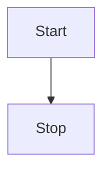
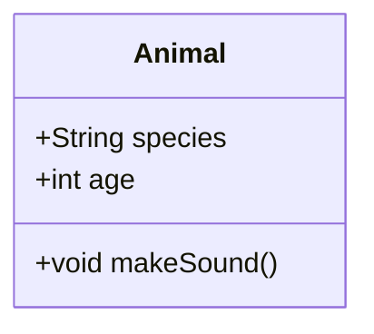
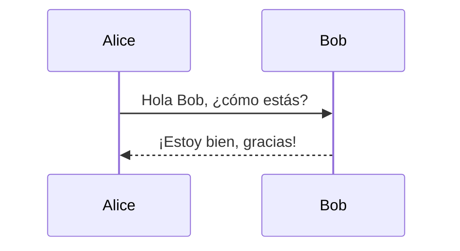

# 🎨✨ Plantillas de Diagramas y Esquemas para README.md en GitHub ✨🎨

¡Bienvenidos a este repositorio! Aquí encontrarás una colección de plantillas y modelos de diagramas y esquemas que puedes incluir en tu `README.md` para hacer tu repositorio más atractivo y profesional. 📊🖼️

---

## 🚀 **¿Qué encontrarás aquí?**

- **Diagramas de flujo** 🧩
- **Diagramas de secuencia** 🎬
- **Diagramas de clases** 🏷️
- **Diagramas de estado** 🚦
- **Gráficos de Gantt** 📅
- **Diagramas ER** 🔗
- **Mapas mentales** 🧠
- **Diagramas de pastel** 🥧
- **Diagramas de arquitectura** 🏛️
- ¡Y mucho más! 🌟

---

## 📚 **¿Cómo usar estas plantillas?**

1. **Selecciona una plantilla** que se ajuste a tus necesidades.
2. **Copia el código** proporcionado.
3. **Pégalo en tu `README.md`** y disfruta de un diagrama hermoso y funcional.

### Diagrama de Flujo

### Diagrama de CLASES

### Diagramas de Secuencia

📋 Contribuciones

¡Las contribuciones son bienvenidas! Si tienes una plantilla que quieras compartir, no dudes en hacer un pull request. 🙌

    Haz un fork de este repositorio.
    Crea una nueva rama (git checkout -b feature/nueva-plantilla).
    Realiza tus cambios y haz un commit (git commit -am 'Añadir nueva plantilla').
    Sube tus cambios (git push origin feature/nueva-plantilla).
    Abre un pull request.

🛠️ Herramientas y Tecnologías Utilizadas

    Mermaid: Para crear diagramas y gráficos.
    PlantUML: Para diagramas UML.
    Markdown: Para la documentación.
    GitHub: Para la colaboración y almacenamiento de plantillas.

http://mermaid.js.org/

📢 Contacto

Si tienes alguna pregunta o sugerencia, no dudes en contactarnos. ¡Estamos aquí para ayudarte! 📧

🎉 ¡Gracias por visitar!

¡Esperamos que estas plantillas te sean útiles y hagan que tu documentación sea más dinámica y atractiva! 🌈✨

