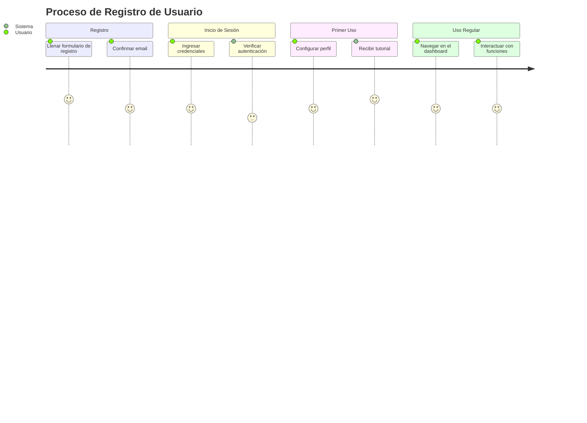

### Beneficios del User Journey

1. **Identificación de Problemas**: Ayuda a descubrir puntos de fricción o dificultad en el proceso del usuario.
2. **Optimización de Experiencia**: Facilita la mejora de la experiencia del usuario al identificar oportunidades de optimización.
3. **Mejora de Producto**: Proporciona información valiosa para el desarrollo y mejora continua del producto.
4. **Alineación del Equipo**: Asegura que todos los miembros del equipo entiendan el recorrido del usuario y trabajen hacia objetivos comunes.

### Uso en Diseño y Desarrollo
- **Diseñadores UX/UI**: Para crear interfaces más intuitivas y agradables.
- **Desarrolladores**: Para comprender mejor cómo los usuarios interactúan con el producto y mejorar la funcionalidad.
- **Gerentes de Producto**: Para tomar decisiones informadas sobre el desarrollo del producto y las prioridades de características.
- **Marketing**: Para entender mejor a los clientes y personalizar estrategias de comunicación y venta.

Un User Journey es una herramienta esencial en el diseño centrado en el usuario y en la mejora continua de productos y servicios.
